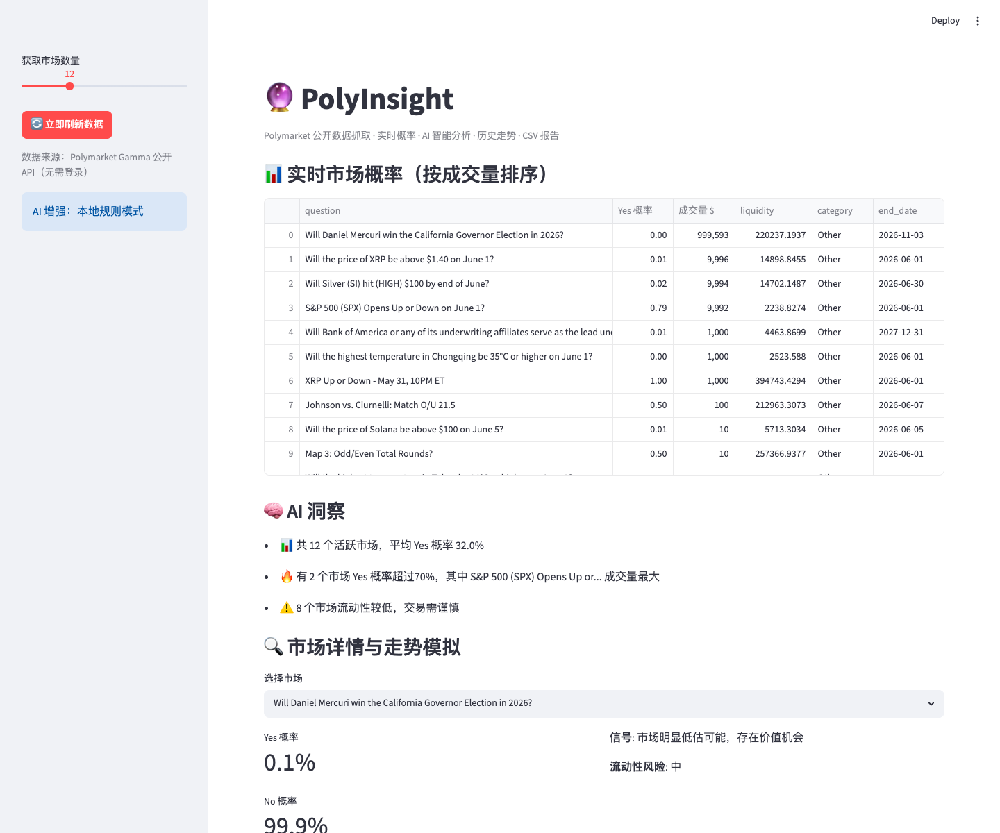

# 🔮 PolyInsight

> **Polymarket 预测市场数据抓取 + AI 智能分析工具**  
> 无需钱包、无需登录，纯公开 API + 本地 AI 分析，帮你每天追踪全球最聪明资金在赌什么。

[](https://python.org/)
[](https://github.com/yeel37/PolyInsight/actions/workflows/python-tests.yml)
[](LICENSE)

**真实价值**：每天 30 秒掌握 Polymarket 最新概率、成交量、流动性风险，AI 给出可执行洞察，导出报告用于研究或交易决策。完美用于 GitHub 档案和 OpenAI Codex 申请。

---

## ✨ 特性

- ✅ **零门槛**：完全公开 Gamma REST API，**不需要任何 API Key、钱包、私钥**
- ✅ **离线可用**：内置高质量 fallback 数据 + 自动降级，网络故障也永不白屏
- ✅ **双入口**：Streamlit 精美可视化 + 命令行一键报告
- ✅ **AI 增强**：本地规则 + 可选 OpenAI/Grok 深度解读
- ✅ **历史可视化**：为每个市场生成合理模拟走势（真实历史需 CLOB 更复杂接口）
- ✅ **一键导出**：CSV 报告直接用于 Excel / Notion / 研究

---

## 🚀 5 分钟快速上手

```bash
git clone https://github.com/yeel37/PolyInsight.git
cd PolyInsight

python3 -m venv .venv
source .venv/bin/activate

pip install -r requirements.txt -i https://pypi.tuna.tsinghua.edu.cn/simple

# 命令行（最快）
python -m polyinsight.cli --limit 8 --export

# 图形界面（推荐）
streamlit run app/streamlit_app.py
```

浏览器打开后，拖动滑块调整市场数量，点击任意市场查看模拟走势和 AI 建议！

---

## 📸 效果预览

**Streamlit 实时市场表格 + 概率 + 一键分析**



**CLI 输出示例**

```
🔮 PolyInsight ...
📈 热门市场 Top 8
• 2025美国总统大选特朗普是否获胜？...
  Yes概率: 57.0% | 成交: $45,200,000
...
🧠 全局洞察：
  - 共 8 个活跃市场...
```

---

## 🛠️ 进阶

- 想看特定分类？CLI 加 `--tag Politics` 或在代码中扩展
- 启用 AI 解读：设置 `OPENAI_API_KEY` 环境变量后重启
- 生产使用：可扩展抓取历史价格（CLOB / Data API），当前版本已足够日常研究

## 🧪 验证与测试

```bash
python -m pytest tests/ -v
python -m polyinsight.cli --limit 2
```

GitHub Actions 会在每次 push 和 pull request 时自动运行测试，状态可在仓库顶部徽章查看。

## 🗓️ 更新日志

项目维护记录见 [CHANGELOG.md](CHANGELOG.md)。

---

## 📁 结构

```
PolyInsight/
├── README.md
├── data/
│   └── polymarket_fallback.json
├── src/polyinsight/
│   ├── config.py
│   ├── client.py          # Gamma API + 完美回退
│   ├── analyzer.py        # 概率解读 + 风险信号
│   └── cli.py
├── app/streamlit_app.py
├── tests/
└── reports/
```

---

## ⚠️ 免责声明

本工具仅做公开数据聚合与统计分析，**不构成任何投资建议**。预测市场有风险，交易需谨慎。

---

## 📜 License

MIT。欢迎 Star、Fork、用于任何研究或商业场景！

---

**开始追踪全球最聪明资金的「集体智慧」吧！**
